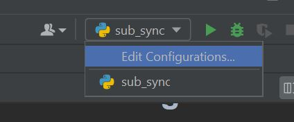
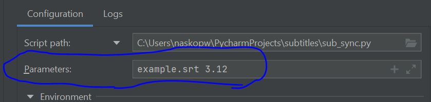

# Problem

In this problem you are going to write your first useful program - a program that synchronizes subtitles.
<br>
It is so annoying when you watch a video with subtitles, and they show up on the screen X seconds later/earlier than
they are supposed to.

# Background

The SubRip text file format is a very common caption/subtitle format. SubRip files are named with the extension .srt,
and are therefore also referred to as SRT files. The file contents are simple and easy to read.
<br>
<br>
This program will not accept user input with the input() function as we did up to now. It will accept command line
arguments instead. That would allow us to build a simple command line interface with useful information how to use the
tool.

# What are Command Line Arguments?

Command line arguments are nothing but simply arguments that are specified after the name of the program in the system’s
command line, and these argument values are passed on to your program during program execution.
<br>
Example -

```code bash
# --version is a cmd argument to the python program
python --version 
```

# Pycharm config

In order to add cmd arguments to Pycharm follow those steps:




# Input

(As cmd arguments)

* a SRT subtitle file
* a float representing the offset in seconds (If the offset is negative, it is guaranteed to be correct - it cannot
  produce negative timings. Example - If a subtitles starts at 00:00:00, and I try to offset it with -3 seconds, it will
  end up being -00:00:03. You won't have to handle such cases).

* -o (Optional) - Output file path, if this cmd argument is present the default output filename should be overwritten

# Output

* A file with the updated subtitle timings

# Usage example

```code sh
# Prints the help menu
python sub_sync --help

# Moves the subtitles in file: 'example.srt' 3.0 seconds forward
python sub_sync example.srt 3.0

# Moves the subtitles in file: 'example.srt' 3.0 seconds backward
python sub_sync example.srt -3.0

# Moves the subtitles in file: 'example.srt' 3.0 seconds backward
# and saves the result to a file in she same dir called test.srt
python sub_sync example.srt -3.0 -o test.srt
```

```code sh
# Creates a file 'output.srt' with the synchronized subtitles
> output.srt file created
```

# Features

* Implement the command line interface
* If no cmd arguments are provided print something like this

```
usage: This is a simple program that can synchronize srt files [-h] file offset
This is a simple program that can synchronize srt files: error: the following arguments are required: file, offset

```

* Print a help message when the `-h` argument is provided

```
usage: This is a simple program that can synchronize srt files [-h] file offset

positional arguments:
  file        Input srt file
  offset      The offset of the subtitles in seconds, it can be positive or negative

optional arguments:
  -h, --help  show this help message and exit

```

* You CANNOT use any libraries for parsing the command line arguments
* Implement the main feature - being able to move subtitles forward/backward

# Hints

* To terminate the program you can use sys.exit()
* To get the cmd arguments provided to your program you can use sys.argv
* Read more about them in the official python documentation
* How to read a text file you can find again in the official documentation section - "Input and Output - 7.2"
* Read really carefully the datetime documentation you can find helpful information there